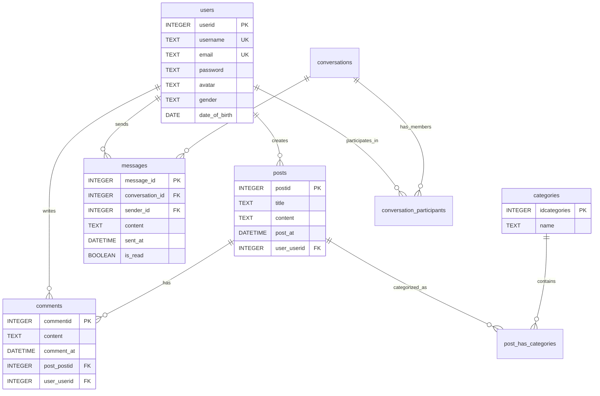

# Connecthub RT 🌐⚡


[](https://golang.org/)
[](https://www.docker.com/)
[](LICENSE.md)
[](https://html.spec.whatwg.org/)
[](https://www.w3.org/Style/CSS/)
[](https://www.ecma-international.org/publications-and-standards/standards/ecma-262/)
[](https://www.sqlite.org/)
[](https://developer.mozilla.org/en-US/docs/Web/API/WebSockets_API)
[](https://github.com/gorilla/mux)

---

<p align="center">
  <strong>Connecthub RT</strong><br/>
  <em>A real-time forum + chat built with Go, WebSocket, and SQLite.</em>
</p>

<p align="center">
  Posts • Comments • Categories • Private chat • Live updates
</p>

<p align="center">
  <a href="#-what-makes-this-special">Highlights</a> •
  <a href="#-getting-started-super-easy">Get Started</a> •
  <a href="#-for-developers-api-stuff">API</a> •
  <a href="#-the-database-behind-it-all">Database</a> •
  <a href="#-screenshots">Screenshots</a>
</p>

<p align="left">
  
  
  
  
  
  
</p>

---


Welcome to **Connecthub RT**, a real-time forum and messaging app built in **Go**. It combines a classic discussion feed (posts, comments, categories) with live features like instant updates and private chat.

The goal of the project is simple: build a clean, reliable community platform where conversations don’t feel delayed — while practicing real-world backend patterns like sessions, database design, and WebSocket-driven updates.

## 🚀 Quick Start

```bash
git clone https://github.com/sahmedhusain/connecthub-rt.git
cd connecthub-rt
go mod download
./run.sh

Then open: http://localhost:8080
```

---

## 📸 What Does It Look Like?


_Main forum interface — clean layout, easy navigation_

---
## 📋 Table of Contents

- [✨ What Makes This Special](#-what-makes-this-special)
- [🛠️ What We Built It With](#️-what-we-built-it-with)
- [🏗️ How It All Works Together](#️-how-it-all-works-together)
- [💻 What You Need to Run It](#-what-you-need-to-run-it)
- [🚀 Getting Started (Super Easy)](#-getting-started-super-easy)
- [📖 How to Use It](#-how-to-use-it)
- [🔌 For Developers (API Stuff)](#-for-developers-api-stuff)
- [🗄️ The Database Behind It All](#-the-database-behind-it-all)
- [⚡ The Real-Time Magic](#-the-real-time-magic)
- [🔧 For People Who Want to Contribute](#-for-people-who-want-to-contribute)
- [📄 Legal Stuff](#-legal-stuff)
- [🙏 Credits](#-credits)
- [👥 Who Built This](#-who-built-this)


## ⭐ Key Highlights

- **Forum + chat in one app:** posts, comments, categories, and private messaging.
- **Real-time UX:** live comments, online status, and instant message delivery via WebSocket.
- **Go backend + SQLite persistence:** simple architecture with solid fundamentals.
- **Practical security basics:** bcrypt password hashing, validated inputs, and session tokens.
- **Easy to run:** works locally and via Docker.

### 🧩 At a Glance

```text
Browser (HTML/CSS/JS)
   ↕ HTTP (auth, posts, comments)
Go Server (Mux + Handlers) ─── SQLite (persistence)
   ↕ WebSocket (live updates + chat)
Real-time Hub (connections + broadcast)
```

---
## ✨ What Makes This Special

### 🔐 Easy Sign Up and Login


_Registration — quick form, straightforward fields_


_Login — sign in using username or email_

- **No complicated setup** - Just pick a username, add your email, and you're in
- **Flexible login** - Can't remember if you used your username or email? No problem, both work
- **Secure and private** - Your password is safely encrypted, and we use smart session management
- **Personal touch** - Choose your avatar and add your personal details

### 📝 Share Your Thoughts


_Post creation — title, content, and categories_


_Category filtering — browse posts by topic_

- **Write posts** - Share your ideas, ask questions, or start discussions
- **Organize by topics** - Choose categories like "Go", "JavaScript", "Git", etc.
- **See everything at a glance** - Posts show in a clean feed, newest first
- **Join the conversation** - Comment on posts and keep discussions going

### 💬 Chat Like You're There


_Private messaging — real-time chat between users_

- **Private conversations** - Chat one-on-one with anyone
- **See who's online** - Know when your friends are available to chat
- **Never miss a message** - Get notified instantly when someone replies
- **Chat history** - Scroll back through your conversations

### ⚡ It Feels Instant


_Post details — comments update live_


_Comments — updates appear in real time_

- **Live updates** - New posts and comments show up without refreshing the page
- **Typing indicators** - See when someone is typing a response
- **Online status** - Know who's active right now
- **Instant messaging** - Messages appear immediately, like a real chat app

### Why People Love It

| What People Usually Deal With | What Connecthub RT Does | Why It's Better |
| ----------------------------- | ----------------------- | --------------- |
| **"I have to refresh to see new posts"** | Updates appear automatically | ⚡ **No more manual refreshing** |
| **"I don't know who's online"** | See who's active in real-time | 👥 **Feel connected** |
| **"Discussions feel slow"** | Instant messaging and comments | 💬 **Conversations flow naturally** |
| **"Setup is complicated"** | One command to start | 🛠️ **Ready in minutes** |
| **"Can't use on mobile"** | Works great on phones and tablets | 📱 **Truly responsive** |

### The Big Picture

This isn't just another forum. It's built for people who want real conversations. Whether you're learning to code, sharing project ideas, or just want to connect with like-minded people, Connecthub RT makes it feel natural and immediate.

---
## 🛠️ What We Built It With

### The Brain (Backend)

- **Go 1.23.2** - A fast, reliable programming language that's great for web servers
- **SQLite** - A lightweight database that stores everything in one file
- **Gorilla WebSocket** - Makes real-time communication possible
- **Gorilla Mux** - Helps organize all the different web routes
- **bcrypt** - Keeps passwords safe and secure

### The Face (Frontend)

- **Plain JavaScript** - No fancy frameworks, just reliable code that works
- **HTML5 & CSS3** - Modern web standards for a clean, responsive design
- **WebSocket** - The technology that makes everything feel instant

### Safety & Speed

- **UUID tokens** - Unique session IDs that keep you logged in securely
- **Password encryption** - Your password is never stored as plain text
- **Input checking** - Everything you enter gets validated for safety

---
## 🏗️ How It All Works Together

Imagine you're at a busy coffee shop. People are talking, sharing ideas, and having conversations. That's basically what Connecthub RT does, but online.

```
Your Browser (What you see) ↔ Web Server (Go) ↔ Database (SQLite)
       ↓
   WebSocket Connection (Real-time updates)
```

The web server handles all the logic - checking logins, saving posts, managing chats. The database remembers everything. And WebSocket keeps everything synchronized so everyone sees updates instantly.

### Project Layout

```
connecthub-rt/
├── main.go                 # The starting point of everything
├── database/              # Where all your data lives
│   ├── database.go        # Database setup and connections
│   ├── queries.go         # All the data operations
│   └── seed_data.sql      # Sample data for testing
├── repository/            # Clean data access layer
├── server/               # Web server and API endpoints
├── websocket/            # Real-time communication
└── src/                  # Web pages and styling
```

---
## 💻 What You Need to Run It

### Minimum Requirements

- **Computer**: Windows, Mac, or Linux
- **Go**: Version 1.19 or newer (we recommend 1.23.2)
- **Web Browser**: Chrome, Firefox, Safari, or Edge (recent versions)
- **Internet**: For downloading dependencies
- **Storage**: About 100MB of free space

### Recommended Setup

- **Go 1.23.2** - Latest stable version
- **1GB RAM** - For smooth performance
- **Modern browser** - For the best experience

---
## 🚀 Getting Started (Super Easy)

Ready to try it out? Here's how to get Connecthub RT running on your computer.

### Quick Start (2 Minutes)

```bash
# 1. Download the project
git clone https://github.com/sahmedhusain/connecthub-rt.git
cd connecthub-rt

# 2. Install everything automatically
go mod download

# 3. Start the server
./run.sh
```

That's it! Open `http://localhost:8080` in your browser and you're ready to go.

> Tip: `./run.sh` runs locally. `./run.sh docker` runs the same setup using Docker.

### Want to Explore More?

#### Manual Setup

```bash
# Get the code
git clone https://github.com/sahmedhusain/connecthub-rt.git
cd connecthub-rt

# Download dependencies
go mod tidy

# Add some sample data (optional)
go run main.go --reset --test-data

# Start on a specific port
go run main.go --port=3000
```

#### 🐳 Docker - The Easiest Way

Don't want to install Go or deal with dependencies? Docker makes it super simple!

**Prerequisites for Docker:**
- [Docker Desktop](https://www.docker.com/products/docker-desktop/) (for Windows/Mac)
- Or Docker Engine on Linux
- About 500MB free space

**Quick Docker Start:**
```bash
# Clone the project
git clone https://github.com/sahmedhusain/connecthub-rt.git
cd connecthub-rt

# Run with Docker (includes everything!)
./run.sh docker
```

**What happens when you run Docker:**
1. **Downloads** the Docker image (only needed first time)
2. **Builds** the application automatically
3. **Starts** the server on `http://localhost:8080`
4. **Sets up** the database with sample data

**Manual Docker Commands:**
```bash
# Build the Docker image
docker build -t connecthub-rt .

# Run the container
docker run -p 8080:8080 -v $(pwd)/database:/app/database connecthub-rt

# Or use Docker Compose (if available)
docker-compose up --build
```

**Docker Benefits:**
- ✅ **No Go installation needed**
- ✅ **All dependencies included**
- ✅ **Same experience on any computer**
- ✅ **Easy cleanup** - just stop the container
- ✅ **Perfect for testing** different environments

#### Development Mode

```bash
# Install hot reload for development
go install github.com/air-verse/air@latest
air
```

---
## 📖 How to Use It

### First Time Here?

1. **Sign Up** - Create your account with a username and email
2. **Check Your Profile** - Add your name, choose an avatar
3. **Start Exploring** - Look at existing posts and categories
4. **Join In** - Comment on posts or start your own

### Daily Use

#### Reading Posts

- **Browse the feed** - See all posts, newest first
- **Filter by category** - Click "Go", "JavaScript", etc. to focus on topics you care about
- **Read comments** - Click on any post to see the full discussion

#### Creating Content

1. Click **"New Post"** in the top navigation
2. Give your post a clear title
3. Write your content (up to 500 characters)
4. Pick relevant categories
5. Hit **"Post"** - it's live immediately!

#### Chatting

1. **Find someone** - Look at user profiles or the online list
2. **Start chatting** - Click to begin a conversation
3. **Type and send** - Messages appear instantly for both people
4. **Stay connected** - See when people are online

### Pro Tips

- **Categories help** - Use them to find posts about specific technologies
- **Check online status** - Green dot means someone's available to chat
- **Read before posting** - See if your question was already asked
- **Be respectful** - This is a community, treat others well

### Test Accounts

Want to explore without signing up? Use these test accounts:

**Password for all**: `Aa123456`

- `alexchen` - Tech professional
- `marcusr` - Developer
- `priyap` - Cloud engineer
- `jamest` - Startup founder

<details>
<summary><strong>🔌 Developer Notes (API examples)</strong></summary>

## 🔌 For Developers (API Stuff)

### Authentication

#### Sign Up
```http
POST /api/register
{
    "username": "johndoe",
    "email": "john@example.com",
    "password": "securepass123",
    "firstName": "John",
    "lastName": "Doe",
    "gender": "male"
}
```

#### Sign In
```http
POST /api/login
{
    "identifier": "johndoe",
    "password": "securepass123"
}
```

### Working with Posts

#### Create a Post
```http
POST /api/posts
Cookie: session_token=your_token
{
    "title": "My Awesome Post",
    "content": "This is what I want to share...",
    "categories": ["general", "discussion"]
}
```

#### Get Posts
```http
GET /api/posts?category=general&limit=10
```

#### Add a Comment
```http
POST /api/posts/123/comments
Cookie: session_token=your_token
{
    "content": "Great post! I think..."
}
```

### Messaging

#### Send a Message
```http
POST /api/messages
Cookie: session_token=your_token
{
    "recipientId": 456,
    "content": "Hey, how's it going?"
}
```

#### Get Conversations
```http
GET /api/conversations
Cookie: session_token=your_token
```

### Real-Time Connection

```javascript
// Connect to real-time updates
const ws = new WebSocket("ws://localhost:8080/ws");

// Authenticate
ws.send(JSON.stringify({
    type: "auth",
    token: "your_session_token"
}));

// Send a message
ws.send(JSON.stringify({
    type: "message",
    recipientId: 123,
    content: "Hello!"
}));

// Listen for updates
ws.onmessage = (event) => {
    const data = JSON.parse(event.data);
    console.log("New update:", data);
};
```

</details>
---
## 🗄️ The Database Behind It All
<details>
<summary><strong>🗄️ Database (schema + Mermaid ERD)</strong></summary>

Connecthub RT uses SQLite - think of it as a single file that holds all your data, like a super-organized spreadsheet.

### The Main Tables

#### Users
Stores everyone's profile information:
- Names, usernames, emails
- Passwords (safely encrypted)
- Profile pictures and personal details

#### Posts
Your main content:
- Post titles and content
- Who wrote it and when
- Categories it belongs to

#### Comments
Discussions on posts:
- Who commented and what they said
- Links back to the original post

#### Messages
Private conversations:
- Who sent what to whom
- When it was sent
- Read/unread status

#### Categories
Topic organization:
- Names like "Go", "JavaScript", "Git"
- Helps people find relevant content

### How It All Connects

```
Users create Posts and Comments
Posts belong to Categories
Users send Messages to each other
Everything is tracked with timestamps
```

### Database Design



</details>
---
## ⚡ The Real-Time Magic

### What Makes It Feel Instant?

WebSocket technology creates a direct connection between your browser and the server. Instead of constantly asking "any updates?", the server tells you immediately when something happens.

### Real-Time Features

- **Live comments** - See new replies as they're posted
- **Instant messages** - Chat feels like texting
- **Online indicators** - See who's active right now
- **Typing notifications** - Know when someone is composing a message

### How It Works Behind the Scenes

```javascript
// Your browser connects once
const connection = new WebSocket("ws://localhost:8080/ws");

// Server sends updates automatically
// No need to refresh or poll for changes
```

---
## 🔧 For People Who Want to Contribute

### Ways to Help

- **Report bugs** - Found something not working? Let us know
- **Suggest features** - Have ideas for improvements? Share them
- **Write code** - Fix bugs or add new features
- **Improve documentation** - Help make things clearer
- **Test things** - Try different scenarios and report issues

### Getting Started with Contributing

1. **Fork the project** on GitHub
2. **Clone your fork**: `git clone https://github.com/your-username/connecthub-rt.git`
3. **Create a branch**: `git checkout -b my-improvement`
4. **Make changes** and test them
5. **Submit a pull request** with a clear description

### What We Look For

- **Clear code** - Easy to understand and maintain
- **Good tests** - Make sure new features work and don't break existing ones
- **Documentation** - Explain how new features work
- **Consistent style** - Follow the existing code patterns

### Reporting Issues

Found a bug? Please include:
- What you were doing when it happened
- What you expected to happen
- What actually happened
- Steps to reproduce the issue
- Your browser and operating system

---
## 📄 Legal Stuff

This project uses the MIT License. Basically, you can use, modify, and share this code freely. We just ask that you give credit where it's due.

---
## 🙏 Credits

This project was built as part of a learning journey into Go web development. It combines modern web technologies with real-time communication to create something useful and educational.

---
## 👥 Who Built This

- **Sayed Ahmed Husain** - [sayedahmed97.sad@gmail.com](mailto:sayedahmed97.sad@gmail.com)
- **Qasim Aljaffer**
- **Mohammed AlAlawi**
- **Abdulla Alasmawi**

---
## ❓ Frequently Asked Questions

### Getting Started
**Q: Do I need programming experience to use this?**
A: Not at all! It's designed to be user-friendly for everyone.

**Q: Can I use it on my phone?**
A: Yes! It works great on phones, tablets, and computers.

### Technical Questions
**Q: Is my data safe?**
A: Yes - passwords are encrypted, and we follow web security best practices.

**Q: How many people can use it at once?**
A: It’s built with concurrency in mind (Go + WebSocket). Practical limits depend on your machine, network, and workload, so it’s best validated with load testing for your target environment.

**Q: Does it work offline?**
A: The basic interface loads, but real-time features need an internet connection.

### Contributing
**Q: I'm new to coding - can I still help?**
A: Absolutely! You can help with documentation, testing, or suggesting improvements.

**Q: How do I report a bug?**
A: Use the GitHub Issues page with clear steps to reproduce the problem.

---
## 📚 What I Learned

This project taught me:

- Real-time web application development with Go and WebSocket.
- Database design and efficient querying with SQLite.
- Secure user authentication and session management.
- Frontend integration with modern HTML, CSS, and JavaScript.
- Containerization and deployment best practices.

---
## 🚫 Limitations

- No advanced search functionality.
- Basic moderation features.
- Limited scalability for extremely high traffic.

---
## 🔮 Future Improvements

- Implement advanced search and filtering.
- Add comprehensive moderation tools.
- Enhance scalability with microservices.
- Integrate additional authentication providers.
- Add push notifications for mobile devices.

---
## 🎯 What This Project Is About

Connecthub RT exists to make online discussions feel more natural and immediate. Instead of waiting for page refreshes or dealing with slow forums, you get real-time updates that make conversations flow like they would in person.

Whether you're here to learn, teach, or just connect with interesting people, we hope you enjoy using it as much as we enjoyed building it!

---

*Built with Go and WebSocket, with a focus on real-time interaction and clean fundamentals.*
